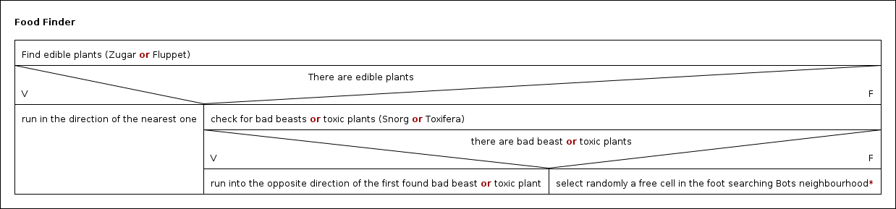

scala-Workshop: Follow Up
=========================

## 1. Starting Point
The current bot implementation of the [Scala Basic Workshop](https://github.com/plipp/informatica-scala-2016) is quite
dumb: 
- it just tries to avoid sticking at walls, but once trapped in a room-like wall-fragment, it just moves back and force
and can't escape any more. 
- it only knows about 'W' (Walls) and is not aware of good plants, bad plants, ... 

## 2. Follow up Exercise - Energy Saving Bot Implementation

### Implemented Strategy


([structogram](https://en.wikipedia.org/wiki/Nassi%E2%80%93Shneiderman_diagram))

*the random selection of a free cell, if no edible plants and no bad beasts/plants are around, increases the Bots chance
to escape half-closed rooms.

### Source and Test Code

- Files

```
    src/
    |-- main
    |   |-- scala
    |       |-- Bot.scala       <- Entry Point, with classes ControlFunction, PathFinder, MyView
    |       |-- Cell.scala      <- Helper (model)
    |       `-- Entities.scala  <- Helper (model)
    `-- test
        `-- scala
            |-- BotTest05.scala
            |-- CellTest.scala
            `-- MyViewTest08.scala
```
- Classes
  - Entry Point: `PathFinder.findPath`
  
### Specials

- The Ordering of sorted Lists can be defined by implementing the `scala.math.Ordering`-Trait, as done in 
`Cell.ByLengthAscAndBoostDesc` and `Cell.ByLengthAscAndNegBoostAsc`

- The following code is a richer alternative to the traditional `scala.Enumeration`:
```scala
object Entities {

  sealed abstract class Entity (val abbreviation: Char, val energyBoost: Int)

  // the player itself
  case object Bot extends Entity('M',0)
//...
  case object Hidden extends Entity ('?', 0) // an hidden obstacle

  val entities = Seq(Bot,Fluppet,Snorg,Zugar,Toxifera,Wall)
  val abbreviationToEntity = entities.map(entity => entity.abbreviation -> entity).toMap
}
```

### How to run the `Foot Finder Bot`
    
1. Check out this [Scala Workshop Follow Up](https://github.com/plipp/informatica-scala-2016-follow-up):<br>
   `git clone git@github.com:plipp/informatica-scala-2016-follow-up.git` or <br>
   `git clone https://github.com/plipp/informatica-scala-2016-follow-up.git`

2. Import the scala workshop follow-up project into IntelliJ: `informatica-scala-2016-follow-up/build.sbt`<br>
   ... can take some time as it downloads the whole internet ...
   
3. `test` and `deploy` the Bot-plugin and start the Scalatron-Server as described in the [Bot Development README](https://github.com/plipp/informatica-scala-2016/tree/master/docs/bot-development)

 References

- [Scalatron Game Rules](https://github.com/plipp/scalatron/blob/master/Scalatron/doc/markdown/Scalatron%20Game%20Rules.md)
- [Scalatron Game Protocol](https://github.com/plipp/scalatron/blob/master/Scalatron/doc/markdown/Scalatron%20Protocol.md)

- [Scalatron Server Setup](https://github.com/plipp/scalatron/blob/master/Scalatron/doc/markdown/Scalatron%20Server%20Setup.md#botwar-game-options)